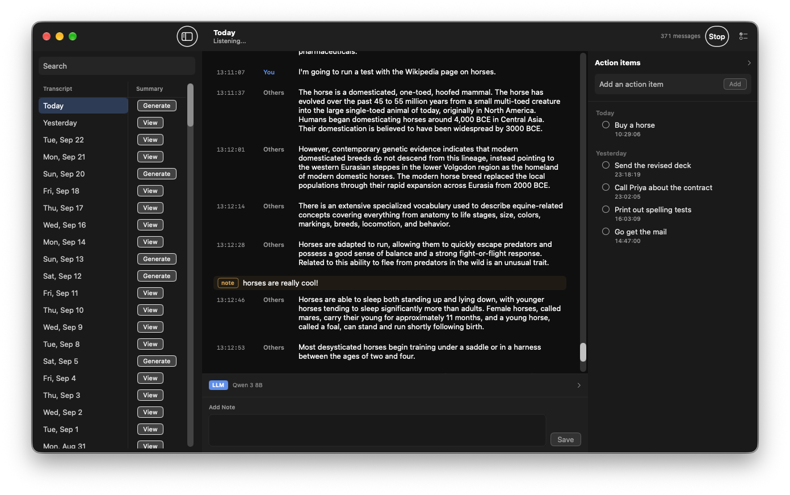

# Stenojot

## About

I wanted a transcription tool that stayed on my computer and was still useful after the words were written down. The local tools I tried could turn speech into text, and then they stopped. I wanted one app that could do all of this:

- Transcribe a conversation well, including both sides of a call
- Force replacements, so names, terms, and recurring mistakes come out the way I want
- Annotate the transcript as it happens, and keep those notes with the text
- Use a local language model to pull action items out of what was said
- Use a local language model to write a summary of the day
- Ask that same model questions about part of a transcript, or about the whole day

Nothing I found did all of that together, so I built Stenojot.

For building, architecture, and the database, see [Developing Stenojot](DEVELOPMENT.md).

The name is steno and jot. Steno is shorthand for writing down what was said. Jot is the note that stays with it. The speech model inside the app is NVIDIA Parakeet. 

## Download

[Download Stenojot](https://github.com/CamHenlin/Stenojot/releases/latest/download/Stenojot.zip) for an Apple Silicon Mac on macOS 14 or later.

Unzip it and move **Stenojot** to Applications. The first time you open it, Control-click the app and choose Open, then Open again. macOS does not recognize this copy's signature, so a normal double-click stays blocked until you do that.

The zip does not include the transcription packages or the model weights. Those download on first launch.

It is a Mac app. It listens while you talk, writes the transcript down as you go, and keeps everything on the machine. The language model runs on the Mac too, so questions, action items, and daily summaries stay there with the transcript.

## Features

### Transcription

- Listens to the microphone and, with permission, to call audio, so both sides of a conversation are transcribed
- Labels each line **You** or **Others**
- On headphones, the two sides stay separate on their own. On speakers, call audio is taken out of the microphone so the other person is not written down twice
- If call audio is declined, the microphone is still transcribed
- Starts listening when the app opens. Closing the window leaves it running. Quitting stops it
- New lines appear as they are saved. The transcript stays pinned to the latest line until you scroll up
- Drops a stray "Yeah" or "Okay" that shows up in a notification sound or other background noise
- A Start / Stop button at the top of the window halts transcription and starts it again. Transcription is on when the app opens, and can be restarted from the window if listening stops

### Reading the transcript

- Days are listed in a sidebar. The window opens on the latest day
- Search filters the day list and the lines on the selected day. Matches include the transcript and notes
- Click one line, then another, to select a stretch. Copy puts that stretch on the clipboard, including notes that fall inside it
- Escape clears a selection in progress

### Notes

- Click the gap between lines to insert a note
- Type a longer note in the composer at the bottom of the window
- Notes can be edited or deleted

### Text replacements

- A list of find-and-replace rules, edited from the toolbar
- Each new line is rewritten before it is saved
- Matching is by whole word and ignores case
- A rule with an empty replacement deletes the matched text
- Leftover punctuation and extra spaces are cleaned up
- Apply to All Past Transcripts rewrites what is already saved. A line that becomes empty is removed, along with notes attached to it

### Asking questions

- A language model runs on the Mac. It downloads once and stays on disk
- Ask about the full day, or about the stretch you selected. The same selection you can copy is what the model sees
- The question includes who said each line, and any notes in that stretch
- The reply streams into the panel and is saved on the transcript
- The instruction that steers those answers can be edited in the panel
- Several model sizes are available, from a small one that fits a short question on an 8 GB Mac to larger ones that handle a full day more comfortably

### Action items

- A checklist sits beside the transcript and can be shown or hidden
- After a pause of about 30 seconds, the model reads the latest stretch and adds concrete tasks
- A stretch is only scanned once
- Add, check off, and delete items yourself
- The list still accepts items you type when no model is downloaded

### Daily summaries

- Each day has Generate, or View once a summary exists
- The day is split into stretches. A new stretch starts after more than a minute with nothing said, so two conversations that follow each other closely can stay in one stretch
- Notes are included when they add something the transcript does not
- Action items for the day are appended on their own
- A second pass reads the finished summary and removes passages that add nothing, such as a note that someone only said "Yeah"
- The result can be edited and saved
- Regenerate in the summary window replaces that day's summary, which is useful after changing the system prompt
- If the app stays open past midnight, it writes summaries for the days that ended while it was running. A day it was closed for is left alone until you press Generate
- The instruction for each stretch, and the instruction for the cleanup pass, can each be edited. An empty instruction uses the built-in one

### Your files

- Transcripts, notes, action items, and summaries live in a database on this Mac
- Replacements, prompts, and the chosen model live in a settings file on this Mac
- On first launch, start empty or import an existing database, and optionally an existing settings file
- Import Database… and Import Settings… can replace those files later

## First launch

1. Launch Stenojot.
2. Choose an existing `transcriptions.db`, or click Start Empty. Import uses a SQLite backup, so the `-wal` file is included. The copy lives at `~/Library/Application Support/Stenojot/transcriptions.db`. The original file stays where it was.
3. Optionally choose an existing `config.json` in the same sheet. A new install starts with an empty replacement list.
4. Allow the microphone, then allow system audio recording so the other person on a call is transcribed separately.
5. Wait for the one-time `pip install` of `parakeet-mlx` and `numpy`. The Parakeet weights stay in the Hugging Face cache (`~/.cache/huggingface`). The first sidecar launch downloads `mlx-community/parakeet-tdt-0.6b-v2` if it is not already there.

File > Import Database… and File > Import Settings… can replace those files later. Importing a database replaces the app's copy. Importing settings replaces `config.json`.

## Daily use

Launching the app starts listening and opens the transcript window. Closing the window leaves transcription running. Quit the app to stop the sidecar and unload the language model.

The window opens on the latest day. The sidebar lists days, and the search field filters both the day list and the lines on the selected day. Matches include transcript text and notes. New lines show up as they are saved, and the list stays pinned to the bottom until you scroll up.

Each line is labeled **You** or **Others**. Headphones keep the two streams apart on their own. On speakers, the app subtracts the call audio from the microphone so the other side is not transcribed twice. If system audio is declined, the app still transcribes the microphone and labels those lines You.

### Notes and ranges

Click the gap between lines to insert a note, or type a longer note in the composer at the bottom. Notes can be edited or deleted. Click a transcript line, then another, to select a range. Copy puts that range on the clipboard, including notes that fall inside it. The same range is what the language-model panel sends when you ask a question. Escape clears a selection in progress.

### Text replacements

Text Replacements, in the toolbar, stores find-and-replace rules in `config.json`. Rules run on each new line before it is inserted. Matching is word-boundary and case-insensitive, then punctuation and extra spaces are cleaned up. A rule with an empty replacement deletes the matched text. Apply to All Past Transcripts rewrites existing rows and deletes a row, plus notes anchored to it, when the text becomes empty.

A lone "Yeah" after more than 30 seconds of silence is dropped. Parakeet often hears that in notification sounds.

### Language model

The app runs a language model in-process with MLX. Choose a model from LLM Settings in the menu bar (⇧⌘L). Weights download once into `~/Library/Application Support/Stenojot/models/` and stay there after you quit. Open the LLM panel at the bottom of the transcript to ask about the day.

| Model | Hugging Face id | Download | Memory while loaded |
|---|---|---|---|
| Gemma 3 1B | `mlx-community/gemma-3-1b-it-qat-4bit` | 0.8 GB | About 2 GB |
| Llama 3.2 3B | `mlx-community/Llama-3.2-3B-Instruct-4bit` | 1.8 GB | About 4 GB |
| Qwen 2.5 7B (recommended) | `mlx-community/Qwen2.5-7B-Instruct-4bit` | 4.3 GB | About 7 GB |
| Qwen 3 8B | `mlx-community/Qwen3-8B-4bit` | 4.6 GB | About 8 GB |

Memory above is the weights before a long transcript adds more. Gemma fits a short question on an 8 GB Mac. Qwen 2.5 7B is the better fit for a full day, and is comfortable on 16 GB.

Ask a question about the full day, or about the selected range. The prompt includes transcript lines, with speaker labels, and any notes in that context. The reply streams into the panel and is saved on the transcript as an LLM note. The instruction sent with those questions is edited from System Prompt > Transcript… in the menu bar and stored as `systemPrompt`. Leave it empty to send only the transcript and the question. Reset clears it. Qwen-style `<think>` spans are stripped from the streamed text.

The same loaded model writes action items and daily summaries. Switching models unloads the previous one.

### Action items

The checklist inspector is open by default. After about 30 seconds of silence, a finished stretch of transcript is sent to the language model, which returns a JSON array of concrete tasks. Those tasks are appended to the list. You can also add, check off, and delete items yourself. The panel still accepts manual items when no model is downloaded. The app remembers the last transcription id it has already scanned, so a stretch is not extracted twice.

The instruction for that extraction is edited from System Prompt > Action Items… in the menu bar and stored as `actionItemsSystemPrompt`. An empty prompt uses the built-in one. Reset restores the built-in text.

### Daily summaries

Each day in the sidebar has Generate, or View once a summary exists. A summary is built from stretches of that day. A new stretch starts only after more than a minute with no transcript, so two conversations that follow each other closely can still land in one stretch. The model summarizes each stretch, notes are included when they add something the transcript does not, and action items are appended separately. A second pass then reads that full summary and removes passages that add no information, such as a note that someone only said "Yeah". The result is editable. Save writes it back. Regenerate in that window runs the summary again and replaces what is saved, including unsaved edits. Change the system prompt first if you want a different result.

If the app stays running across local midnight, it generates summaries for the days that ended while it was open. Opening the app the next morning does not summarize a day it missed. Use Generate for those.

The instruction for each stretch is edited from System Prompt > Summary… in the menu bar. The cleanup pass is edited from System Prompt > Summary Pass 2…. An empty prompt uses the built-in one. Reset in either window restores its built-in text.
